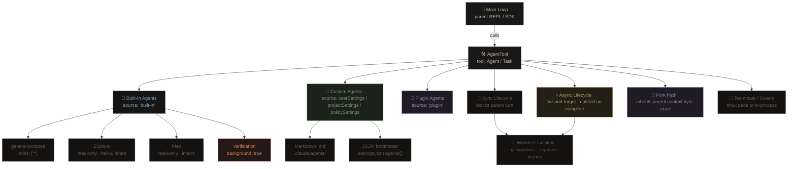
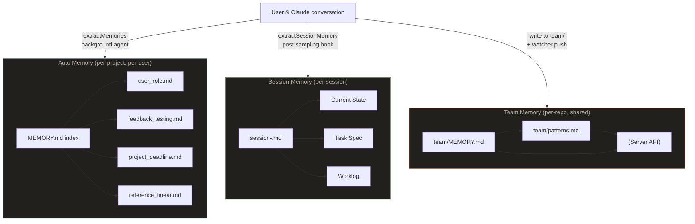
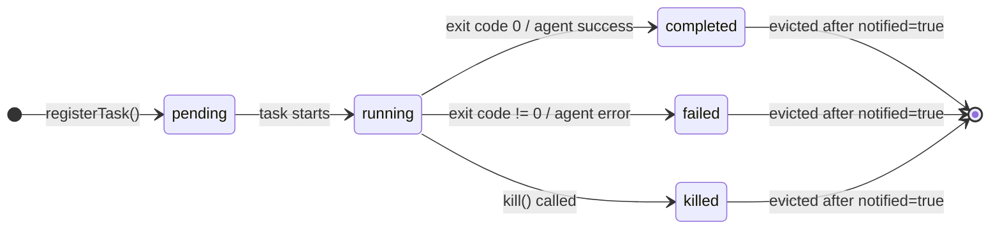

# Diagramas do Curso - Claude Code Source Deep Dive

> **71 diagramas em 41 licoes**
>
> Todos os diagramas Mermaid extraidos do curso [Claude Code Source Deep Dive](https://www.markdown.engineering/learn-claude-code/), organizados por licao.

---

## Lesson 01: Boot Sequence

### Boot Pipeline Flowchart

Fluxograma completo do pipeline de inicializacao do Claude Code, desde o keystroke `claude` ate o primeiro render do REPL. Aparece na secao "Architecture".

```mermaid
flowchart TD A["**Process starts**\ncli.tsx — main()"] --> B["Set COREPACK_ENABLE_AUTO_PIN=0\nSet NODE_OPTIONS if CCR remote"] B --> C{"Fast-path\ncheck"} C -->|"--version / -v"| V["Print version\nprocess.exit(0)"] C -->|"--daemon-worker"| D["runDaemonWorker()"] C -->|"remote-control / bridge"| BR["bridgeMain()"] C -->|"no fast-path"| E["profileCheckpoint('cli_entry')\nDynamic import main.tsx"] E --> F["**main() in main.tsx**\nprofileCheckpoint('main_function_start')"] F --> G["startMdmRawRead()\nstartKeychainPrefetch()\n[top-level side effects]"] G --> H["profileCheckpoint('main_tsx_entry')\nLoad all static imports\n~135ms module eval"] H --> I["profileCheckpoint('main_tsx_imports_loaded')"] I --> J["initializeWarningHandler()\nRegister SIGINT / exit handlers"] J --> K["eagerLoadSettings()\n--settings / --setting-sources early parse"] K --> L["Commander.parse()\nResolve: cwd, permissionMode,\nmodel, session flags..."] L --> M["init() from entrypoints/init.ts\napplySafeConfigEnvironmentVariables()\nensureMdmSettingsLoaded()"] M --> N["runMigrations()\nSettings schema upgrades\nmigrationVersion check"] N --> O["**setup(cwd, permissionMode, ...)**"] O --> P["Node.js ≥18 check\nCustom session ID if --session"] P --> Q{"isBareMode?"} Q -->|"No"| R["startUdsMessaging()\ncaptureTeammateModeSnapshot()"] Q -->|"Yes"| S["Skip UDS + teammate snapshot"] R --> T["setCwd(cwd)\ncaptureHooksConfigSnapshot()\ninitializeFileChangedWatcher()"] S --> T T --> U{"--worktree\nflag?"} U -->|"Yes"| WT["createWorktreeForSession()\ncreateTmuxSessionForWorktree()\nsetProjectRoot()"] U -->|"No"| BG["Background jobs:\ninitSessionMemory()\ngetCommands() prefetch\nloadPluginHooks()"] WT --> BG BG --> AN["initSinks()\nlogEvent('tengu_started')"] AN --> PF["prefetchApiKeyFromApiKeyHelperIfSafe()\ncheckForReleaseNotes()"] PF --> PERM["Permission safety checks\n(root/sudo guard,\nsandbox gate for ants)"] PERM --> PREV["Log previous session exit metrics\nfrom projectConfig"] PREV --> REPL["**launchRepl()**\nreplLauncher.tsx"] REPL --> INK["import App + REPL components\nrenderAndRun() via ink.ts"] INK --> DONE["**First render — user sees prompt**"] DONE --> DEF["startDeferredPrefetches()\ninitUser / getUserContext /\nsettingsChangeDetector ..."] style A fill:#22201d,stroke:#7d9ab8,color:#b8b0a4 style DONE fill:#1d211b,stroke:#6e9468,color:#b8b0a4 style V fill:#241816,stroke:#c47a50,color:#b8b0a4 style REPL fill:#1f1b24,stroke:#8e82ad,color:#b8b0a4
```

---

## Lesson 02: Tool System

### Tool Lifecycle

Ciclo de vida completo de uma invocacao de ferramenta, desde a definicao da interface ate a orquestracao e emissao do resultado. Aparece na secao "Architecture: From Interface to Result".

```mermaid
flowchart TD A["**Tool Interface**  
(Tool.ts)  
name · inputSchema · call · checkPermissions  
isConcurrencySafe · isReadOnly · isDestructive"] -->|"buildTool() fills defaults"| B B["**Registration**  
(tools.ts)  
getAllBaseTools() → getTools() → assembleToolPool()  
Feature flags · env vars · deny-rule filtering"] -->|"readonly Tool[]"| C C["**Routing / Dispatch**  
(toolExecution.ts: runToolUse)  
findToolByName() · alias fallback  
abort-before-start check"] -->|"tool found"| D D["**Input Validation**  
(toolExecution.ts)  
Zod safeParse → schema errors  
tool.validateInput() → semantic errors  
backfillObservableInput cloning"] -->|"parsedInput"| E E["**Permission Gate**  
(toolExecution.ts: checkPermissions­AndCallTool)  
PreToolUse hooks → hookPermissionResult  
canUseTool() · alwaysAllow / alwaysDeny rules  
Interactive prompt / auto-classifier"] -->|"behavior: allow"| F F["**Execution**  
(tool.call)  
async generator · onProgress callback  
ToolResult<Output> + contextModifier  
PostToolUse hooks"] -->|"ToolResult"| G G["**Result Processing**  
(toolExecution.ts)  
mapToolResultToToolResultBlockParam  
processToolResultBlock (size budget)  
yield MessageUpdateLazy"] -->|"MessageUpdate"| H H["**Orchestration**  
(toolOrchestration.ts / StreamingToolExecutor)  
partitionToolCalls · concurrent vs serial  
sibling-abort on Bash error  
in-order result emission"] style A fill:#22201d,stroke:#7d9ab8,color:#b8b0a4 style B fill:#22201d,stroke:#7d9ab8,color:#b8b0a4 style C fill:#1a1816,stroke:#8e82ad,color:#b8b0a4 style D fill:#1a1816,stroke:#8e82ad,color:#b8b0a4 style E fill:#231f16,stroke:#b8965e,color:#b8b0a4 style F fill:#1d211b,stroke:#6e9468,color:#b8b0a4 style G fill:#1a1816,stroke:#8e82ad,color:#b8b0a4 style H fill:#22201d,stroke:#c47a50,color:#b8b0a4
```

---

## Lesson 03: Skills System

### Skill Lifecycle

Ciclo de vida de uma skill, desde a descoberta nos diretorios ate a injecao no contexto da conversa. Aparece na secao "Architecture".

```mermaid
flowchart LR 
D["**Discovery**  
Walk managed / user /  
project / --add-dir paths.  
Read dir entries.  
Resolve symlinks."] 
L["**Load**  
Read SKILL.md.  
Parse YAML frontmatter.  
Estimate token budget."] 
P["**Parse**  
Extract all frontmatter  
fields into Command  
object. Validate hooks,  
paths, effort, shell."] 
S["**Substitute**  
Replace $ARGUMENTS,  
$1/$name, shell !backtick,  
${CLAUDE_SKILL_DIR},  
${CLAUDE_SESSION_ID}."] 
E["**Execute**  
Run inline (expand into  
conversation) or fork  
(isolated sub-agent with  
own token budget)."] 
I["**Inject**  
Tool result enters  
conversation. Allowed  
tools and model override  
applied for this turn."] 
D --> L --> P --> S --> E --> I 
style D fill:#22201d,stroke:#7d9ab8,color:#b8b0a4 
style L fill:#22201d,stroke:#7d9ab8,color:#b8b0a4 
style P fill:#22201d,stroke:#6e9468,color:#b8b0a4 
style S fill:#22201d,stroke:#c47a50,color:#b8b0a4 
style E fill:#22201d,stroke:#8e82ad,color:#b8b0a4 
style I fill:#22201d,stroke:#6e9468,color:#b8b0a4
```



---

## Lesson 04: Query Engine

### Full Message Flow Sequence

Diagrama de sequencia mostrando o fluxo completo de mensagens para um turno de conversa com chamadas de ferramentas. Aparece na secao "Full Message Flow".

```mermaid
sequenceDiagram participant User participant QE as QueryEngine<br/>submitMessage() participant Q as query() /<br/>queryLoop() participant QM as queryModel<br/>(claude.ts) participant API as Anthropic API<br/>(streaming) participant Tools as Tool<br/>Executor participant SH as stopHooks.ts
User->>QE: submitMessage(prompt)
QE->>QE: fetchSystemPromptParts()<br/>buildSystemInitMessage()
QE->>Q: query({ messages, systemPrompt, ... })
Q->>Q: applyToolResultBudget()<br/>microcompact / snip / autocompact
loop queryLoop — one iteration per model call
Q->>QM: callModel({ messages, tools, ... })
QM->>API: POST /v1/messages (streaming, withRetry)
API-->>QM: stream: content_block_delta events
QM-->>Q: yield AssistantMessage (text / tool_use blocks)
Q->>Q: StreamingToolExecutor tracks tool_use blocks
alt tool_use blocks present
Q->>Tools: runTools(toolUseBlocks)
Tools-->>Q: yield progress + tool_result UserMessages
Q->>Q: append tool_results to messages
Note over Q: needsFollowUp = true → loop continues
else no tool calls
Note over Q: needsFollowUp = false
Q->>SH: handleStopHooks()
SH-->>Q: yield hook progress/attachments
alt hook blocking error
Q->>Q: append blockingError, loop again
else hook prevents continuation
Q-->>QE: Terminal { reason: 'stop_hook_prevented' }
else clean stop
Q->>Q: checkTokenBudget()
alt budget says continue
Q->>Q: inject nudge message, loop again
else budget says stop
Q-->>QE: Terminal { reason: 'completed' }
end
end
end
end
QE-->>User: yield SDKMessage stream<br/>(assistant / user / result)
```

---

## Lesson 05: Agent System

### Agent Runtime Architecture

Hierarquia completa do sistema de agentes mostrando tipos de agentes, modos de execucao e isolamento. Aparece na secao "Architecture".



---

## Lesson 06: Permissions

### Permission Decision Pipeline

Pipeline completo de decisao de permissoes, mostrando todos os passos desde a requisicao ate allow/deny/ask. Aparece na secao "The Decision Pipeline".

```mermaid
flowchart TD START(\[Tool use requested\]) --> ABORT{Session\\naborted?} ABORT -->|yes| THROW(\[Throw AbortError\]) ABORT -->|no| S1A subgraph STEP1\["Step 1 — Rule & Safety Checks (always run)"\] S1A{Deny rule\\nfor tool?} -->|yes| DENY1(\[deny\]) S1A -->|no| S1B S1B{Ask rule\\nfor tool?} -->|"yes (no sandbox)"| ASK1(\[ask\]) S1B -->|"no / sandbox allowed"| S1C S1C\["tool.checkPermissions(input)"\] --> S1D S1D{Result =\\ndeny?} -->|yes| DENY2(\[deny\]) S1D -->|no| S1E S1E{requiresUser\\nInteraction?} -->|"yes + ask"| ASK2(\[ask\]) S1E -->|no| S1F S1F{Content ask\\nrule matched?} -->|yes| ASK3(\[ask\]) S1F -->|no| S1G S1G{Safety check\\n.git/.claude/\\nshell configs?} -->|yes| ASK4(\[ask\]) S1G -->|no| STEP2 end subgraph STEP2\["Step 2 — Mode & Allow Rule Checks"\] M1{bypassPermissions\\nor plan+bypass?} -->|yes| ALLOW1(\[allow\]) M1 -->|no| M2 M2{Tool-wide\\nallow rule?} -->|yes| ALLOW2(\[allow\]) M2 -->|no| PASSTHRU PASSTHRU\["Convert passthrough → ask"\] end STEP1 --> STEP2 PASSTHRU --> STEP3 subgraph STEP3\["Step 3 — Mode Transformations (post-ask)"\] T1{mode =\\ndontAsk?} -->|yes| DENY3(\[deny\]) T1 -->|no| T2 T2{mode = auto\\nor auto+plan?} -->|yes| AUTOF T2 -->|no| T3 T3{shouldAvoid\\nPrompts?} -->|yes| HOOKS T3 -->|no| ASK5(\[ask user\]) subgraph AUTOF\["Auto Mode Fast Paths"\] AF1{Non-classifier\\nsafety check?} -->|yes| ASK6(\[ask/deny\]) AF1 -->|no| AF2 AF2{acceptEdits\\nwould allow?} -->|yes| ALLOW3(\[allow\]) AF2 -->|no| AF3 AF3{Tool on safe\\nallowlist?} -->|yes| ALLOW4(\[allow\]) AF3 -->|no| AF4 AF4\["classifyYoloAction()"\]:::classifier --> AF5 AF5{shouldBlock?} -->|yes| DENY4(\[deny/ask on limit\]) AF5 -->|no| ALLOW5(\[allow\]) end HOOKS\["Run PermissionRequest hooks"\] --> HOOKD HOOKD{Hook\\ndecision?} -->|allow/deny| HD(\[hook result\]) HOOKD -->|none| DENY5(\[deny — headless\]) end classDef classifier fill:#211b14,stroke:#b8965e,color:#b8965e
```

---

## Lesson 07: MCP System

### Transport Types

Diagrama mostrando os 8 tipos de transporte MCP suportados pelo Claude Code. Aparece na secao "Transport Types".

```mermaid
graph LR A(\[Claude Code CLI\]) --> B{Transport Type} B -->|stdio| C\[StdioClientTransport  
Subprocess spawn\] B -->|sse| D\[SSEClientTransport  
Persistent EventSource +  
OAuth / ClaudeAuthProvider\] B -->|http| E\[StreamableHTTPClientTransport  
JSON + SSE on same POST  
OAuth / session ingress\] B -->|ws| F\[WebSocketTransport  
ws module or Bun WS\] B -->|sse-ide| G\[SSEClientTransport  
IDE extension only  
no auth\] B -->|ws-ide| H\[WebSocketTransport  
IDE extension with  
optional auth token\] B -->|sdk| I\[SdkControlClientTransport  
In-process / control msgs\] B -->|in-process| J\[InProcessTransport  
Linked pair  
Chrome / Computer Use\] style C fill:#22201d,stroke:#7d9ab8,color:#b8b0a4 style D fill:#22201d,stroke:#6e9468,color:#b8b0a4 style E fill:#22201d,stroke:#6e9468,color:#b8b0a4 style F fill:#22201d,stroke:#b8965e,color:#b8b0a4 style G fill:#22201d,stroke:#c47a50,color:#b8b0a4 style H fill:#22201d,stroke:#c47a50,color:#b8b0a4 style I fill:#22201d,stroke:#8e82ad,color:#b8b0a4 style J fill:#22201d,stroke:#8e82ad,color:#b8b0a4
```

### OAuth PKCE Flow

Diagrama de sequencia do fluxo de autenticacao OAuth com PKCE para servidores MCP. Aparece na secao "OAuth Authentication".

```mermaid
sequenceDiagram participant C as Claude Code CLI participant KS as Keychain / SecureStorage participant AS as Auth Server participant MCP as MCP Server C->>C: client.connect(transport) → 401 UnauthorizedError C->>C: set server state: needs-auth C->>C: inject McpAuthTool pseudo-tool Note over C: Model calls mcp\_\_server\_\_authenticate C->>AS: discoverOAuthServerMetadata() AS-->>C: authServerMetadata (PKCE endpoint) C->>AS: /authorize?code\_challenge=…&redirect\_uri=… C-->>C: open browser / return URL AS-->>C: callback → authorization\_code C->>AS: POST /token (code + verifier) AS-->>C: access\_token + refresh\_token C->>KS: store tokens (keychain on macOS) C->>MCP: reconnectMcpServerImpl() MCP-->>C: connected — real tools swap in
```



---

## Lesson 08: Memory System

### Three Memory Layers

Arquitetura das tres camadas de memoria: Auto Memory, Session Memory e Team Memory. Aparece na secao "Architecture".



---

## Lesson 09: Plugin System

### Plugin Lifecycle

Ciclo de vida completo de um plugin, do startup ao registro de comandos, skills, hooks e agentes. Aparece na secao "Plugin Lifecycle".

```mermaid
flowchart TD subgraph STARTUP\["Startup (non-blocking)"\] direction TB S1\["getDeclaredMarketplaces()\\nMerge settings + --add-dir sources"\] S2\["diffMarketplaces()\\nCompare declared vs known\_marketplaces.json"\] S3{"Missing or\\nsource changed?"} S4\["reconcileMarketplaces()\\ngit clone / http fetch / npm install"\] S5\["Auto-refresh plugins\\nor set needsRefresh flag"\] S1 --> S2 --> S3 S3 -->|"Yes"| S4 --> S5 S3 -->|"No"| S5 end subgraph AUTOUPDATE\["Background Autoupdate"\] direction TB U1\["getAutoUpdateEnabledMarketplaces()\\nOfficial = true by default"\] U2\["refreshMarketplace() — git pull / re-fetch"\] U3\["updatePluginsForMarketplaces()\\nupdatePluginOp() per installation"\] U4\["Notify REPL via onPluginsAutoUpdated()"\] U1 --> U2 --> U3 --> U4 end subgraph INSTALL\["Plugin Install (user-triggered)"\] direction TB I1\["parseMarketplaceInput()\\nResolve 'name@marketplace'"\] I2\["isPluginBlockedByPolicy()"\] I3\["resolveDependencyClosure()\\nDFS walk, cycle detect, cross-mkt block"\] I4\["For each dep in closure:\\ngetPluginById() from marketplace"\] I5\["installPlugin() — clone / fetch / npm"\] I6\["calculatePluginVersion()\\n1. plugin.json 2. provided 3. git SHA 4. 'unknown'"\] I7\["copyPluginToVersionedCache()\\n~/.claude/plugins/cache/{mkt}/{plugin}/{ver}/"\] I8\["updateSettingsForSource()\\nenablePlugins\[id\] = true"\] I1 --> I2 --> I3 --> I4 --> I5 --> I6 --> I7 --> I8 end subgraph LOAD\["Load Phase (cache-only, per session)"\] direction TB L1\["loadAllPluginsCacheOnly()\\nRead settings.enabledPlugins"\] L2\["verifyAndDemote()\\nFixed-point dep check, demote broken"\] L3\["detectAndUninstallDelistedPlugins()\\nAuto-uninstall removed marketplace entries"\] L4\["loadPluginManifest()\\nParse plugin.json via PluginManifestSchema"\] L5\["Resolve paths:\\ncommands/, agents/, skills/, hooks/, mcpServers, lspServers"\] L1 --> L2 --> L3 --> L4 --> L5 end subgraph REGISTER\["Registration"\] direction TB R1\["getPluginCommands()\\nParse .md files → namespaced /plugin:cmd"\] R2\["getPluginSkills()\\nScan skills/ for SKILL.md subdirs"\] R3\["loadPluginHooks()\\nConvert to PluginHookMatcher\[\]"\] R4\["loadPluginAgents()\\nRegister agent .md files"\] R5\["mcpPluginIntegration\\nConnect MCP servers, inject userConfig"\] R6\["lspPluginIntegration\\nRegister LSP servers"\] R1 & R2 & R3 & R4 & R5 & R6 end STARTUP --> AUTOUPDATE AUTOUPDATE --> LOAD INSTALL --> LOAD LOAD --> REGISTER style STARTUP fill:#0f1a2e,stroke:#7d9ab8,color:#b8b0a4 style AUTOUPDATE fill:#0f2a1a,stroke:#6e9468,color:#b8b0a4 style INSTALL fill:#1a0f2e,stroke:#8e82ad,color:#b8b0a4 style LOAD fill:#1a1a0f,stroke:#b8965e,color:#b8b0a4 style REGISTER fill:#2a0f1a,stroke:#c47a50,color:#b8b0a4
```

### Dependency Name Resolution

Diagrama mostrando como nomes de dependencias sao resolvidos entre marketplaces. Aparece na secao "Dependency Resolution".

```mermaid
flowchart LR subgraph "Dependency Name Resolution" N1\["'shared-utils'\\n(bare name)"\] -->|"declaring plugin is acme@acme-mkt"| N2\["'shared-utils@acme-mkt'\\n(qualified)"\] N3\["'shared-utils@acme-mkt'\\n(already qualified)"\] --> N3 N4\["'shared-utils'\\n(from --plugin-dir plugin)"\] -->|"@inline sentinel → unchanged"| N4 end style N2 fill:#1a2a0f,stroke:#6e9468,color:#b8b0a4 style N3 fill:#0f1a2a,stroke:#7d9ab8,color:#b8b0a4 style N4 fill:#2a1a0f,stroke:#b8965e,color:#b8b0a4
```

---

## Lesson 10: Hooks System

### Hook Execution Flow

Fluxo de execucao de um hook PreToolUse, mostrando filtragem por matcher e como exit codes determinam o comportamento. Aparece na secao "Hook Execution".

```mermaid
flowchart TD
A(\[Tool call requested\]) --> B{Any hooks for\\nPreToolUse?}
B -- No --> Z(\[Tool executes normally\])
B -- Yes --> C\[Filter by matcher\\ne.g. tool\_name = Write\]
C --> D\[Run each matched hook\\ncommand / prompt / agent / http / function\]
D --> E{All hooks passed?}
E -- "exit 0" --> Z
E -- "exit 2 → blocking" --> F(\[stderr shown to model\\ntool call BLOCKED\])
E -- "other → non-blocking" --> G(\[stderr shown to USER\\ntool call continues\])
E -- "function hook false" --> F
style A fill:#22201d,stroke:#7d9ab8,color:#b8b0a4
style Z fill:#0a2a1a,stroke:#6e9468,color:#b8b0a4
style F fill:#221714,stroke:#c47a50,color:#b8b0a4
style G fill:#211b14,stroke:#b8965e,color:#b8b0a4
```

---

## Lesson 12: State Management

### Full Data Flow

Fluxo completo de dados mostrando como atualizacoes de estado propagam desde o dispatch do componente ate o re-render do React. Aparece na secao "Full Data Flow".

```mermaid
flowchart TD A["Component calls\nuseSetAppState()"] -->|"returns store.setState"| B["store.setState(updater)"] B --> C{"Object.is(next, prev)?"} C -->|"same"| Z["Return — no-op"] C -->|"changed"| D["state = next"] D --> E["onChangeAppState({ newState, oldState })"] E --> F1["permission mode changed?"] E --> F2["mainLoopModel changed?"] E --> F3["expandedView changed?"] E --> F4["settings changed?"] F1 -->|"yes"| G1["notifySessionMetadataChanged\nnotifyPermissionModeChanged"] F2 -->|"yes"| G2["updateSettingsForSource\nsetMainLoopModelOverride"] F3 -->|"yes"| G3["saveGlobalConfig"] F4 -->|"yes"| G4["clearAuthCaches\napplyConfigEnvironmentVariables"] D --> H["for listener of listeners: listener()"] H --> I["useSyncExternalStore\ntriggers re-render"] I --> J["selector(store.getState())\ncompares with Object.is"] J -->|"changed"| K["Component re-renders"] J -->|"same"| L["Render skipped"]
```

---

## Lesson 13: Commands System

### Type Decision Tree

Arvore de decisao mostrando como o tipo de um comando e determinado (local, local-jsx ou prompt). Aparece na secao "Command Types".

```mermaid
flowchart TD A[User types /cmd] --> B{Does it need\nto render UI?} B -- Yes --> C[local-jsx\ne.g. /model, /help] B -- No --> D{Does it call\nthe AI model?} D -- Yes --> E[prompt\ne.g. /commit, /review] D -- No --> F[local\ne.g. /clear, /compact, /cost] style C fill:#1f1249,stroke:#8e82ad,color:#b8b0a4 style E fill:#2a1900,stroke:#c47a50,color:#b8b0a4 style F fill:#0a2a16,stroke:#6e9468,color:#b8b0a4
```

### Command Dispatch Sequence

Diagrama de sequencia mostrando o despacho de comandos entre os tres tipos. Aparece na secao "Command Dispatch".

```mermaid
sequenceDiagram participant U as User Input participant R as REPL participant LC as LocalCommand participant LJ as LocalJSX participant PC as PromptCommand participant M as Model U->>R: /compact "focus on DB" R->>R: findCommand("compact") R->>LC: load() then call(args, ctx) LC-->>R: {type:'compact', ...} R->>R: update messages state U->>R: /model R->>LJ: load() then call(onDone, ctx, args) LJ-->>R: ReactNode (renders picker UI) R->>R: onDone() → resume input U->>R: /commit R->>PC: getPromptForCommand(args, ctx) PC-->>R: ContentBlockParam[] R->>M: send as user turn M-->>R: streaming response
```



---

## Lesson 14: Task System

### Task Lifecycle State Machine

Maquina de estados mostrando os cinco estados do ciclo de vida de uma tarefa em background. Aparece na secao "Task Lifecycle".



---

## Lesson 15: Context Compaction

### Microcompact Paths

Diagrama mostrando os tres caminhos do microcompact: time-based, cached e fallback. Aparece na secao "Microcompact".

```mermaid
flowchart TD A[microcompactMessages called] --> B{Time-based trigger?} B -- Yes, gap > threshold --> C[Time-Based MC\nContent-clear old tool results\nmutate messages directly] B -- No --> D{feature CACHED_MC\n+ supported model?} D -- Yes --> E[Cached MC Path\nQueue cache_edits block\ndo NOT mutate messages] D -- No --> F[Return messages unchanged\nautocompact handles pressure] C --> G[Reset cachedMCState\nreturn mutated messages] E --> H[Return messages + pendingCacheEdits\nAPI layer inserts edits] style C fill:#b8965e,color:#fff style E fill:#22201d,color:#fff style F fill:#141211,color:#5c564f
```

### Session Memory Compaction

Fluxo de compactacao usando session memory como resumo, sem chamada LLM. Aparece na secao "Session Memory Compaction".

```mermaid
flowchart LR A["Messages: [... old ... | SUMMARIZED | NEW ]"] --> B["findLastSummarizedIndex()"] B --> C["calculateMessagesToKeepIndex()\n(start from summarized+1,\nexpand backward to meet minimums)"] C --> D["adjustIndexToPreserveAPIInvariants()\n(pull in orphaned tool_use pairs\n+ thinking block partners)"] D --> E["messagesToKeep = messages.slice(startIndex)\n.filter(!isCompactBoundary)"] E --> F["Build CompactionResult\nwith session memory as summary\nno LLM call needed"] style F fill:#22201d,color:#fff
```

### Full LLM Compaction Sequence

Sequencia completa de compactacao via LLM com hooks pre/pos-compactacao. Aparece na secao "Full LLM Compaction".

```mermaid
sequenceDiagram participant Q as Query Loop participant C as compactConversation() participant H as Pre-Compact Hooks participant F as Forked Agent participant P as Post-Compact Q->>C: messages, toolUseContext C->>H: executePreCompactHooks() H-->>C: customInstructions (merged) C->>F: streamCompactSummary() with 9-section prompt F-->>C: summary text (analysis + summary XML) Note over C: formatCompactSummary() strips <analysis> block C->>P: createCompactBoundaryMessage() C->>P: createPostCompactFileAttachments() — up to 5 files C->>P: processSessionStartHooks() C-->>Q: CompactionResult{boundaryMarker, summaryMessages, attachments}
```



---

## Lesson 16: Settings & Config

### 5-Layer Cascade

Diagrama mostrando a cascata de 5 camadas de configuracao, incluindo a sub-cascata de policy. Aparece na secao "Cascade Architecture".

```mermaid
flowchart TD A["Plugin base (lowest)"] --> B["userSettings\n~/.claude/settings.json"]
B --> C["projectSettings\n.claude/settings.json"]
C --> D["localSettings\n.claude/settings.local.json"]
D --> E["flagSettings\n--settings flag + inline"]
E --> F["policySettings\nfirst-source-wins sub-cascade"]
F --> G["Merged SettingsJson\n(getInitialSettings)"]
subgraph PolicySubCascade["policySettings — first-source-wins"]
P1["① Remote API"] -->|"wins if non-empty"| P2["② MDM\n(HKLM / macOS plist)"]
P2 -->|"wins if non-empty"| P3["③ managed-settings.json\n+ drop-in .d/ files"]
P3 -->|"wins if non-empty"| P4["④ HKCU registry\n(Windows only)"]
end
style A fill:#0d1117,stroke:#2a2a4a,color:#847c72
style G fill:#0f3460,stroke:#2a2a4a,color:#e0e0f0
style PolicySubCascade fill:#200a0a,stroke:#f87171
```

### Merge Semantics

Exemplo visual de como as camadas de configuracao sao mescladas. Aparece na secao "Merge Semantics".

```mermaid
flowchart LR U["userSettings\n{model: 'opus', env: {A:'1'}}"] P["projectSettings\n{env: {B:'2'}, permissions: {allow: ['Read']}}"] L["localSettings\n{permissions: {allow: ['Bash(git *)']}}"] M["Merged result\n{model:'opus', env:{A:'1',B:'2'},\npermissions:{allow:['Read','Bash(git *)']}}"]
U --> M
P --> M
L --> M
style M fill:#0f3460,stroke:#2a2a4a,color:#e0e0f0
```

### 3-Tier Cache

Arquitetura de cache de tres niveis para configuracoes. Aparece na secao "Cache Architecture".

```mermaid
flowchart TD A["getInitialSettings()"] --> B{"sessionSettingsCache\nhit?"}
B -- yes --> Z["Return cached SettingsJson"]
B -- no --> C["loadSettingsFromDisk()"]
C --> D{"perSourceCache\nhit per source?"}
D -- yes --> E["Use cached per-source settings"]
D -- no --> F{"parseFileCache\nhit per path?"}
F -- yes --> G["Use cached parsed JSON"]
F -- no --> H["readFileSync + Zod parse"]
H --> F
E --> I["mergeWith all sources"]
G --> I
I --> B
style Z fill:#0a2a1e,stroke:#34d399,color:#34d399
```

### Change Detection Sequence

Sequencia de deteccao de mudancas em arquivos de configuracao via chokidar. Aparece na secao "File Watching".

```mermaid
sequenceDiagram participant FS as Filesystem (chokidar)
participant CD as changeDetector
participant Hook as ConfigChange hook
participant Cache as settingsCache
participant Subs as Subscribers
FS->>CD: change / unlink / add event
CD->>CD: consumeInternalWrite? (skip if own write)
CD->>Hook: executeConfigChangeHooks(source, path)
Hook-->>CD: results (blocked or not)
CD->>Cache: resetSettingsCache()
CD->>Subs: settingsChanged.emit(source)
Subs->>Cache: getSettingsWithErrors() [cache miss → disk reload]
```

### Remote Managed Settings Fetch

Ciclo de vida da busca de configuracoes remotas gerenciadas. Aparece na secao "Remote Managed Settings".

```mermaid
sequenceDiagram participant Init as CLI init
participant RMS as RemoteManagedSettings
participant API as Anthropic API
participant FS as Disk cache
participant CD as changeDetector
Init->>RMS: loadRemoteManagedSettings()
RMS->>FS: read cached settings (sync, getRemoteManagedSettingsSyncFromCache)
FS-->>RMS: cached settings (if any)
RMS->>Init: resolve loading promise (unblocks waiters immediately)
RMS->>API: GET /api/claude_code/settings\nIf-None-Match: "sha256:..."
API-->>RMS: 200 new settings / 304 not modified / 204 no content / 404
RMS->>RMS: security check (dangerous changes need user approval)
RMS->>FS: save new settings (mode 0o600)
RMS->>CD: notifyChange('policySettings')
CD->>CD: resetSettingsCache() + fanOut
Note over Init,CD: Background poll every 1 hour
```

---

## Lesson 17: Bash Tool

### Architecture Overview

Visao geral da arquitetura da Bash Tool, do comando emitido pelo Claude ate o resultado processado. Aparece na secao "Architecture".

```mermaid
flowchart TD A["Claude emits Bash(command)"] --> B["validateInput\n(sleep-pattern guard)"] B --> C["checkPermissions\nbashToolHasPermission()"] C -->|allow| D["call()"] C -->|ask| E["Permission dialog"] C -->|deny| F["Blocked"] E -->|approved| D D --> G["runShellCommand generator"] G --> H["buildExecCommand\n(snapshot + eval wrap)"] H --> I["shouldUseSandbox?\nSandboxManager.wrap"] I --> J["spawn shell process\ndetached=true"] J --> K["async output streaming\nonProgress callbacks"] K --> L["interpretCommandResult\n(semantic exit codes)"] L --> M["output persistence\n(>30KB → disk)"] M --> N["mapToolResultToToolResultBlockParam"] style A fill:#1a1a2e,stroke:#e94560,color:#e94560 style F fill:#2a0d0d,stroke:#f87171,color:#f87171 style J fill:#071a10,stroke:#34d399,color:#34d399
```

### Shell Snapshot System

Sistema de snapshot do shell que captura o ambiente do usuario no inicio da sessao. Aparece na secao "Shell Snapshot".

```mermaid
flowchart LR A["Session start"] --> B["createAndSaveSnapshot(shellPath)"] B --> C["getSnapshotScript()"] C --> D["source .zshrc / .bashrc\n< /dev/null"] D --> E["Capture:\n• Functions (typeset -f)\n• Shell options (setopt)\n• Aliases (alias --)\n• PATH (process.env.PATH)\n• rg / find / grep shims"] E --> F["Write snapshot-{ts}-{rand}.sh"] F --> G["buildExecCommand()\nsource snapshot || true"] style A fill:#1a1a2e,stroke:#7ec8e3,color:#7ec8e3 style F fill:#071a10,stroke:#34d399,color:#34d399
```

### Command Building Pipeline

Pipeline de construcao de comandos, do comando bruto ate a string final. Aparece na secao "Command Building".

```mermaid
flowchart TD A["raw command string\n(from Claude)"] --> B["rewriteWindowsNullRedirect()\n2>nul → 2>/dev/null"] B --> C["shouldAddStdinRedirect()?\nappend < /dev/null"] C --> D["quoteShellCommand()\nwrap in single quotes for eval"] D --> E{"contains | pipe\nAND needs stdin redirect?"} E -->|yes| F["rearrangePipeCommand()\nmove < /dev/null to first segment"] E -->|no| G F --> G["Assemble command parts:\n1. source snapshot || true\n2. source sessionEnvScript\n3. disable extglob\n4. eval 'quoted_cmd'\n5. pwd -P >| cwd-file"] G --> H{"CLAUDE_CODE_SHELL_PREFIX\nset?"} H -->|yes| I["formatShellPrefixCommand()\nwrap entire string"] H -->|no| J["Final commandString"] I --> J style A fill:#1a1a2e,stroke:#e94560,color:#e94560 style J fill:#071a10,stroke:#34d399,color:#34d399
```

### Permission Plumbing

Pipeline de verificacao de permissoes do Bash Tool com 7 etapas. Aparece na secao "Permission Plumbing".

```mermaid
flowchart TD A["bashToolHasPermission(input, context)"] --> B["checkPermissionMode()\nread-only mode?"] B -->|deny| Z1["deny"] B -->|pass| C["bashCommandIsSafe()\n23 validators"] C -->|ask| Z2["ask — security concern"] C -->|allow| D["checkReadOnlyConstraints()"] C -->|pass| D D -->|deny| Z3["deny — read-only violation"] D -->|pass| E["checkPathConstraints()\npath allowlist / denylist"] E -->|deny| Z4["deny — path out-of-scope"] E -->|pass| F["checkSedConstraints()\nsed -i detection"] F -->|ask| Z5["ask — sed preview dialog"] F -->|pass| G["checkCommandOperatorPermissions()\nper-subcommand rule matching"] G -->|allow| Z6["allow"] G -->|ask| Z7["ask — needs user rule"] G -->|deny| Z8["deny — explicit deny rule"] style Z6 fill:#071a10,stroke:#34d399,color:#34d399 style Z1 fill:#2a0d0d,stroke:#f87171,color:#f87171 style Z8 fill:#2a0d0d,stroke:#f87171,color:#f87171
```

---

## Lesson 19: Search Tools

### Pagination Pipeline

Pipeline de paginacao mostrando como head_limit e offset funcionam nas ferramentas de busca. Aparece na secao "Pagination".

```mermaid
graph LR A["ripgrep raw output\n(e.g. 10,000 lines)"] --> B["applyHeadLimit(items, limit, offset)"] B --> C["items.slice(offset, offset+limit)\ne.g. slice(0, 250)"] C --> D["Return to model\nwith appliedLimit hint"] D --> E["Model calls again\nwith offset=250"]
```

---

## Lesson 21: Coordinator Mode

### Coordinator-Worker Architecture

Arquitetura do modo coordenador mostrando despacho de trabalho para workers em paralelo. Aparece na secao "Architecture".

```mermaid
flowchart TD U["🧑 User"] C["📋 Coordinator  
CLAUDE_CODE_COORDINATOR_MODE=1"] W1["💻 Worker A  
research"] W2["💻 Worker B  
implementation"] W3["💻 Worker C  
verification"] U -->|"request"| C C -->|"Agent(...)"| W1 C -->|"Agent(...)"| W2 C -->|"SendMessage(...)"| W2 C -->|"Agent(...)"| W3 W1 -->|"task-notification"| C W2 -->|"task-notification"| C W3 -->|"task-notification"| C C -->|"synthesis + status"| U style U fill:#1a1816,stroke:#c47a50,color:#b8b0a4 style C fill:#22201d,stroke:#c47a50,color:#c47a50 style W1 fill:#1f241d,stroke:#6e9468,color:#6e9468 style W2 fill:#241f2a,stroke:#8e82ad,color:#8e82ad style W3 fill:#262117,stroke:#b8965e,color:#b8965e
```

---

## Lesson 23: Sandbox Security

### Sandbox Architecture

Arquitetura do sandbox mostrando seatbelt (macOS) e bubblewrap (Linux) como backends. Aparece na secao "Architecture".

```mermaid
flowchart TD CC["Claude Code\n(sandbox-adapter.ts)"] --> |"convertToSandboxRuntimeConfig()"| CFG["SandboxRuntimeConfig\n{ network, filesystem, ripgrep ... }"]
CFG --> BSM["BaseSandboxManager\n(@anthropic-ai/sandbox-runtime)"]
BSM -->|macOS| SB["seatbelt\n(sandbox-exec)"]
BSM -->|Linux/WSL2| BW["bubblewrap (bwrap)\n+ seccomp filter\n+ socat proxy"]
SB --> PROC["sandboxed\nprocess"]
BW --> PROC
CC --> |"wrapWithSandbox(cmd)"| BSM
PROC --> |"violation event"| VS["SandboxViolationStore"]
VS --> UI["SandboxDoctorSection\nstderr annotation"]
style CC fill:#22201d,stroke:#7d9ab8,color:#b8b0a4
style BSM fill:#1a1816,stroke:#8e82ad,color:#b8b0a4
style SB fill:#1f241d,stroke:#6e9468,color:#b8b0a4
style BW fill:#1f241d,stroke:#6e9468,color:#b8b0a4
style PROC fill:#2a201b,stroke:#c47a50,color:#b8b0a4
```

### Secure Storage

Arquitetura de armazenamento seguro com keychain no macOS e plaintext no Linux. Aparece na secao "Secure Storage".

```mermaid
flowchart LR GS["getSecureStorage()"] -->|"darwin"| FS["createFallbackStorage(\n macOsKeychainStorage,\n plainTextStorage\n)"]
GS -->|"linux/other"| PT["plainTextStorage\n~/.config/claude/.credentials.json\nchmod 0o600"]
FS --> KC["macOsKeychainStorage\nsecurity(1) CLI\nadd-generic-password\nfind-generic-password"]
FS --> PT2["plainTextStorage\n(fallback if keychain unavailable)"]
style GS fill:#22201d,stroke:#7d9ab8,color:#b8b0a4
style FS fill:#1a1816,stroke:#8e82ad,color:#b8b0a4
style KC fill:#1f241d,stroke:#6e9468,color:#b8b0a4
style PT fill:#2a201b,stroke:#c47a50,color:#b8b0a4
style PT2 fill:#2a201b,stroke:#b8965e,color:#b8b0a4
```

---

## Lesson 24: Cost Analytics

### Two-Pipeline Architecture

Arquitetura de dois pipelines para rastreamento de custos e analytics. Aparece na secao "Architecture".

```mermaid
flowchart TD
API["API Response\n(token usage)"] --> CostTracker["cost-tracker.ts\naddToTotalSessionCost()"]
CostTracker --> OTelCounter["OTel Counters\ngetCostCounter() / getTokenCounter()"]
CostTracker --> LogEvent["logEvent()\nservices/analytics/index.ts"]
LogEvent --> Queue["Event Queue\n(pre-sink buffer)"]
Queue --> Sink["initializeAnalyticsSink()\nservices/analytics/sink.ts"]
Sink --> SampleCheck{"shouldSampleEvent()\nGrowthBook rate"}
SampleCheck -->|"rate=0 → drop"| Drop["Dropped"]
SampleCheck -->|"rate>0 → keep"| DatadogGate{"tengu_log_datadog_events\nGrowthBook gate"}
DatadogGate -->|"enabled"| StripProto["stripProtoFields()\nremove _PROTO_* keys"]
StripProto --> Datadog["trackDatadogEvent()\nHTTP batch → Datadog"]
DatadogGate -->|"any"| FirstParty["logEventTo1P()\nOTel BatchLogRecordProcessor"]
FirstParty --> Exporter["FirstPartyEventLoggingExporter\n/api/event_logging/batch"]
OTelCounter --> MeterProvider["OTel MeterProvider"]
MeterProvider --> BigQuery["BigQueryMetricsExporter\n/api/claude_code/metrics"]
MeterProvider --> CustomerOTLP["Customer OTLP Endpoint\n(opt-in via CLAUDE_CODE_ENABLE_TELEMETRY)"]
```

### First-Party Pipeline Sequence

Sequencia de processamento de eventos do pipeline first-party com retry e persistencia em disco. Aparece na secao "First-Party Pipeline".

```mermaid
sequenceDiagram
participant App
participant Logger as 1P Logger<br/>(OTel Logger)
participant Batch as BatchLogRecordProcessor
participant Exporter as FirstPartyEventLoggingExporter
participant Disk as Failed Events<br/>(JSONL on disk)
participant API as /api/event_logging/batch
App->>Logger: emit({ body: eventName, attributes })
Logger->>Batch: onEmit(log record)
Note over Batch: Buffer until scheduledDelayMillis<br/>or maxExportBatchSize (200)
Batch->>Exporter: export(logs[])
Exporter->>Exporter: transformLogsToEvents()<br/>hoist _PROTO_* keys
Exporter->>API: POST /api/event_logging/batch
alt success
API-->>Exporter: 200 OK
Exporter->>Disk: delete failed events file
else failure
API-->>Exporter: 5xx / timeout
Exporter->>Disk: appendEventsToFile()<br/>JSONL append (atomic)
Exporter->>Exporter: scheduleBackoffRetry()<br/>quadratic: base * attempts²
end
```

---

## Lesson 25: OAuth Auth

### Full PKCE Sequence

Sequencia completa do fluxo OAuth 2.0 com PKCE automatico, desde a geracao do code verifier ate o armazenamento seguro dos tokens. Aparece na secao "Full OAuth Flow".

```mermaid
sequenceDiagram participant U as User participant CC as Claude Code (CLI) participant LS as LocalServer :PORT/callback participant B as Browser participant AS as Auth Server claude.com / platform participant TS as Token Server platform.claude.com/v1/oauth/token participant PS as Profile API api.anthropic.com CC->>CC: generateCodeVerifier() generateCodeChallenge() generateState() CC->>LS: AuthCodeListener.start() (OS assigns port) CC->>B: openBrowser(automaticFlowUrl) ?code_challenge=S256&state=...&redirect_uri=localhost:PORT CC-->>U: Show manual URL fallback in terminal B->>AS: GET /oauth/authorize?client_id=...&code_challenge=... AS->>U: Login page (email / SSO / magic link) U->>AS: Authenticate AS->>B: 302 → http://localhost:PORT/callback?code=AUTH_CODE&state=STATE B->>LS: GET /callback?code=AUTH_CODE&state=STATE LS->>LS: validate state === expectedState LS-->>CC: resolve(authorizationCode) CC->>TS: POST /v1/oauth/token { grant_type: authorization_code, code, code_verifier, redirect_uri } TS-->>CC: { access_token, refresh_token, expires_in, scope } CC->>PS: GET /api/oauth/profile Authorization: Bearer access_token PS-->>CC: { account, organization } CC->>LS: handleSuccessRedirect(scopes) → 302 success page CC->>CC: installOAuthTokens() save to keychain / secure storage
```

---

## Lesson 30: Notification System

### addNotification Decision Tree

Arvore de decisao da funcao addNotification mostrando prioridade, folding e invalidacao. Aparece na secao "Notification Queue Logic".

```mermaid
flowchart TD A["addNotification(notif)"] --> B{priority\n=== 'immediate'?} B -->|Yes| C["clearTimeout(currentTimeoutId)"] C --> D["Set new timeout for this notif\n(timeoutMs ?? 8000 ms)"] D --> E["setAppState: current = notif\nqueue = [prev current if not immediate,\n...prev queue]\n.filter(not immediate,\nnot in invalidates)"] E --> F["return early"] B -->|No| G{notif.fold\ndefined?} G -->|Yes| H{current.key\n=== notif.key?} H -->|Yes| I["fold(current, notif)\nreset timeout\nreturn folded as current"] H -->|No| J{queue has\nsame key?} J -->|Yes| K["fold(queue[i], notif)\nreplace in queue"] J -->|No| L{key already\nin queue\nor current?} G -->|No| L L -->|Yes, duplicate| M["return prev (no-op)"] L -->|No| N{notif.invalidates\ncontains current.key?} N -->|Yes| O["clearTimeout\ncurrent = null"] N -->|No| P["Keep current as-is"] O --> Q["append notif to queue\n(filtered of invalidated)"] P --> Q Q --> R["processQueue()"]
```

### Full Architecture Map

Mapa completo da arquitetura de notificacoes incluindo toast queue, OS notifier, background tasks e MCP channel. Aparece na secao "Architecture".

```mermaid
graph TD subgraph "In-REPL Toast Queue" CTX["context/notifications.tsx\nuseNotifications()\naddNotification / removeNotification"] AS["AppState\n{ current: Notification|null\n queue: Notification[] }"] NR["PromptInput/Notifications.tsx\nOrchestrator + Renderer"] HOOKS["hooks/notifs/*.tsx\n14 specialized hooks"] CTX -- "setAppState()" --> AS AS -- "useAppState()" --> NR HOOKS -- "addNotification()" --> CTX NR -- "runs hooks\non mount" --> HOOKS end subgraph "OS/Terminal Notifier" SN["services/notifier.ts\nsendNotification()"] TN["ink/useTerminalNotification.ts\nwriteRaw() via context"] TTY["TTY stdout\nOSC / BEL escapes"] SN -- "channel dispatch" --> TN TN -- "OSC 9/99/BEL" --> TTY end subgraph "Background Tasks" CBN["utils/collapseBackgroundBashNotifications.ts"] MSG["Message list\n(pre-render)"] CBN -- "collapses run\nof completed\nbash tasks" --> MSG end subgraph "MCP Channel (Kairos)" MCN["services/mcp/channelNotification.ts"] Q["Command queue\nhasCommandsInQueue()"] MCN -- "wrapChannelMessage()\nenqueue" --> Q end NR -.->|"task done\n(long-running)"| SN
```

---

## Lesson 31: Vim Mode

### Vim Transition Table State Machine

Maquina de estados completa do modo vim, mostrando transicoes entre estados do modo normal baseadas na entrada do usuario. Aparece na secao "State Machine".

```mermaid
stateDiagram-v2
  [*] --> idle
  idle --> count : digit 1-9
  idle --> operator : d / c / y
  idle --> find : f F t T
  idle --> g : g
  idle --> replace : r
  idle --> indent : > or <
  idle --> idle : execute (motion / action)
  count --> count : digit 0-9
  count --> operator : d / c / y
  count --> idle : execute (motion / action)
  operator --> operatorCount : digit
  operator --> operatorTextObj : i / a
  operator --> operatorFind : f F t T
  operator --> operatorG : g
  operator --> idle : execute (dd cc yy or motion)
  operatorCount --> operatorCount : digit
  operatorCount --> idle : execute
  operatorFind --> idle : execute (char received)
  operatorTextObj --> idle : execute (obj type received)
  find --> idle : execute (char received)
  g --> idle : execute (gg / gj / gk)
  operatorG --> idle : execute or cancel
  replace --> idle : execute (char received)
  indent --> idle : execute (>> or <<)
```

---

## Lesson 32: Analytics & Telemetry

### Sink Routing

Fluxograma de roteamento de eventos analytics mostrando sampling, kill-switches e dispatch para Datadog/1P. Aparece na secao "Sink Routing".

```mermaid
flowchart TD
A[logEvent called] --> B{shouldSampleEvent?}
B -- sample_rate=0 --> DROP[Drop event]
B -- sampled --> C{isSinkKilled datadog?}
C -- yes --> E[Skip Datadog]
C -- no --> D{shouldTrackDatadog?}
D -- no --> E
D -- yes --> F[stripProtoFields]
F --> G[trackDatadogEvent]
E --> H[logEventTo1P with full payload]
G --> H
style DROP fill:#c47a50,color:#141211
style G fill:#22201d,color:#b8b0a4
style H fill:#b8965e,color:#141211
```

---

## Lesson 33: Keybindings

### Chord Resolution

Fluxograma de resolucao de acordes de teclado mostrando como teclas pendentes sao combinadas e resolvidas. Aparece na secao "Chord Resolution".

```mermaid
flowchart TD A["Key event arrives"] --> B["Build testChord\n(pending + currentKeystroke)"] B --> C{"Escape key\n+ pending?"} C -->|"Yes"| CANCEL["chord_cancelled"] C -->|"No"| D{"Any live longer\nchord prefix?"} D -->|"Yes"| WAIT["chord_started\n(store pending)"] D -->|"No"| E{"Exact chord\nmatch?"} E -->|"action = null"| UNBOUND["unbound\n(swallow event)"] E -->|"action = string"| MATCH["match\n(fire action)"] E -->|"No match"| F{"Was in chord?"} F -->|"Yes"| CANCEL2["chord_cancelled"] F -->|"No"| NONE["none\n(propagate)"]
```

### Hot-Reload Pipeline

Pipeline de hot-reload de keybindings via chokidar file watching. Aparece na secao "Hot-Reload".

```mermaid
sequenceDiagram participant FS as File System participant CW as chokidar watcher participant LB as loadUserBindings participant Cache as Binding cache participant Sig as keybindingsChanged signal participant UI as React UI FS->>CW: File changed (add/change) Note over CW: awaitWriteFinish 500ms stability CW->>LB: handleChange(path) LB->>LB: loadKeybindings() async LB->>Cache: update cachedBindings + warnings LB->>Sig: emit(result) Sig->>UI: subscribeToKeybindingChanges listener UI->>UI: Re-render with new bindings FS->>CW: File deleted CW->>LB: handleDelete(path) LB->>Cache: reset to DEFAULT_BINDINGS LB->>Sig: emit(defaults)
```

### Full Pipeline

Pipeline completo de keybindings desde bytes raw do terminal ate o handler React. Aparece na secao "Full Pipeline".

```mermaid
flowchart LR subgraph Terminal["Terminal (pty)"] B1["Raw bytes\n\\x1b[13;2u"] end subgraph Parse["parse-keypress.ts"] B2["CSI-u / VT / SGR\ndecodeModifier()"] B3["ParsedKey\n{name:'enter', shift:true}"] B2 --> B3 end subgraph Config["Binding Config"] C1["defaultBindings.ts\nDEFAULT_BINDINGS"] C2["loadUserBindings.ts\n~/.claude/keybindings.json"] C3["parseBindings()\nParsedBinding[]"] C1 --> C3 C2 --> C3 end subgraph Match["match.ts"] M1["getKeyName()\nnormalise Ink flags"] M2["modifiersMatch()\nalt/meta unification"] end subgraph Resolve["resolver.ts"] R1["resolveKeyWithChordState()"] R2["chord prefix check\nchordWinners map"] R3["exact match\nlast-wins scan"] R1 --> R2 --> R3 end subgraph React["React (useKeybinding.ts)"] H1["ChordResolveResult"] H2["handler()"] H3["stopImmediatePropagation()"] H1 --> H2 --> H3 end Terminal --> Parse Parse --> Match Config --> Resolve Match --> Resolve Resolve --> React
```

---

## Lesson 34: Migrations

### Settings Layer Discipline

Diagrama mostrando como o sistema de migracoes interage com as multiplas fontes de configuracao. Aparece na secao "Settings Layer Discipline".

```mermaid
flowchart LR A["userSettings\n(~/.claude/settings.json)"] -->|"migration reads & writes HERE only"| M["Migration\nfunction"] B["projectSettings\n(.claude/settings.json)"] -->|"runtime merge only\nnever mutated"| R["Merged\nSettings"] C["localSettings\n(.claude/settings.local.json)"] -->|"some migrations\nwrite here (MCP)"| M D["policySettings\n(managed)"] -->|"runtime merge only\nnever mutated"| R M --> R A --> R B --> R C --> R D --> R
```

---

## Lesson 35: Dialog UI

### Architecture

Arquitetura do sistema de dialogos mostrando launchers, helpers e componentes de design system. Aparece na secao "Architecture".

```mermaid
flowchart TD A["main.tsx\nsetupScreens()"] -->|"await"| B["dialogLaunchers.tsx\nlaunchXxx(root, props)"] B -->|"dynamic import"| C["Component Module\ne.g. SnapshotUpdateDialog"] B -->|"calls"| D["interactiveHelpers.tsx\nshowSetupDialog()"] D -->|"wraps in"| E["AppStateProvider\n+ KeybindingSetup"] E -->|"root.render()"| F["Dialog / PermissionDialog / Pane\ndesign-system primitives"] F --> G["Feature Component\ne.g. InvalidSettingsDialog,\nBashPermissionRequest"] G --> H["CustomSelect\nor TextInput"] H -->|"user selects"| I["done(result)\nresolves Promise"] I -->|"returns typed value"| A style B fill:#b8965e,color:#141211 style D fill:#22201d,color:#b8b0a4 style F fill:#1a1816,color:#8e82ad style I fill:#6e9468,color:#141211
```

### Full Dialog Lifecycle

Sequencia completa do ciclo de vida de um dialogo, do lancamento ate o retorno do resultado tipado. Aparece na secao "Dialog Lifecycle".

```mermaid
sequenceDiagram participant M as main.tsx participant DL as dialogLaunchers.tsx participant IH as interactiveHelpers.tsx participant R as Ink Root participant C as Dialog Component participant U as User M->>DL: await launchXxxDialog(root, props) DL->>DL: dynamic import(component) DL->>IH: showSetupDialog(root, renderer) IH->>R: root.render(<AppStateProvider><KeybindingSetup>...</>) R->>C: mount Dialog/PermissionDialog with keybindings C->>U: display in terminal U-->>C: keypress (Enter / Esc / arrow) C->>C: useKeybinding fires C->>IH: done(selectedValue) IH->>DL: Promise resolves with typed value DL->>M: returns typed result M->>M: branch on result, continue boot
```

---

## Lesson 36: Upstream Proxy

### CONNECT-over-WebSocket Relay

Diagrama de sequencia mostrando o relay CONNECT-over-WebSocket entre cliente, relay local, gateway CCR e upstream. Aparece na secao "Protocol Handshake".

```mermaid
sequenceDiagram participant C as curl / gh / npm participant R as Local Relay  
127.0.0.1:<port> participant G as CCR Gateway  
(WebSocket) participant U as Real Upstream C->>R: HTTP CONNECT api.example.com:443 R->>G: WS upgrade (Bearer token) G-->>R: 101 Switching Protocols R->>G: encodeChunk(CONNECT line + Proxy-Auth) G-->>R: encodeChunk(HTTP/1.1 200 Connection Established) R-->>C: HTTP/1.1 200 Connection Established C->>R: TLS ClientHello (raw bytes) R->>G: encodeChunk(TLS bytes) G->>U: Forward (MITM TLS, inject headers) U-->>G: Response G-->>R: encodeChunk(response) R-->>C: Response bytes
```

---

## Lesson 37: REPL Screen

### Turn Lifecycle

Ciclo de vida de um turno no REPL, desde o Enter do usuario ate o reset do estado de loading. Aparece na secao "Turn Lifecycle".

```mermaid
flowchart TD A[User presses Enter\nonSubmit] --> B{slash command\nand immediate?} B -->|Yes| C[executeImmediateCommand\nsetToolJSX, skip queue] B -->|No| D[handlePromptSubmit\nin utils/] D --> E{already loading?} E -->|Yes| F[enqueue to\nmessageQueueManager] E -->|No| G[onQuery] G --> H[queryGuard.tryStart\nconcurrency guard] H -->|null = collision| I[enqueue and return] H -->|generation token| J[setMessages + newMessages] J --> K[onQueryImpl] K --> L[getToolUseContext\nbuild full context] L --> M[getSystemPrompt\nparallel with getUserContext] M --> N[query iterator\nfor await event of query] N --> O[onQueryEvent\nhandleMessageFromStream] O --> P{compact boundary?} P -->|Yes| Q[setMessages boundary\nbump conversationId] P -->|No| R[append or replace\nmessage] N --> S[resetLoadingState\nonTurnComplete] S --> T[queryGuard.end\ncheck auto-restore]
```

### Two Render Paths

Dois caminhos de renderizacao: transcript e prompt, com variantes fullscreen e inline. Aparece na secao "Render Paths".

```mermaid
flowchart LR A[screen state] --> B{value} B -- "'transcript'" --> C[Early return\nTranscript render] B -- "'prompt'" --> D[Main render\nmainReturn] C --> E{fullscreen\nenabled?} E -- Yes --> F[AlternateScreen\n+ FullscreenLayout\n+ ScrollBox] E -- No --> G[Inline dump\n30-msg cap\nCtrl+E expand] D --> H{fullscreen\nenabled?} H -- Yes --> I[AlternateScreen\n+ FullscreenLayout\nwith scrollRef] H -- No --> J[mainReturn direct]
```

---

## Lesson 38: Message Processing

### End-to-End Pipeline

Pipeline completo de processamento de mensagens, desde o Enter do usuario ate a chamada da API Anthropic. Aparece na secao "End-to-End Pipeline".

```mermaid
flowchart TD A["**User presses Enter**\nonSubmit in REPL component"] --> B["**handlePromptSubmit()**\nhandlePromptSubmit.ts"] B --> C{"queuedCommands\nalready set?"} C -->|"Yes (queue processor)"| EXEC["**executeUserInput()**\nskip validation"] C -->|"No (direct user input)"| D["Trim input\nFilter orphaned image refs\nexpandPastedTextRefs()"] D --> E{"Exit word?\nexit / quit / :q"} E -->|"Yes"| EXIT["Re-submit as /exit\nor gracefulShutdownSync(0)"] E -->|"No"| F{"Starts with /\nand !skipSlashCommands?"} F -->|"immediate cmd"| IMM["Execute immediately\n(e.g. /config, /doctor)\nsetToolJSX JSX render"] F -->|"no"| G{"queryGuard.isActive\nor externalLoading?"} G -->|"Yes — busy"| QUEUE["**enqueue()**\ncommandQueue push\nnotifySubscribers()"] G -->|"No — idle"| CMD["Wrap as QueuedCommand\nstartQueryProfile()"] CMD --> EXEC EXEC --> WL["runWithWorkload()\nAsyncLocalStorage workload tag"] WL --> PUI["**processUserInput()**\nfor each QueuedCommand"] PUI --> HOOKS1["executeUserPromptSubmitHooks()\ncheck blocking / additional contexts"] HOOKS1 --> BASE["**processUserInputBase()**"] BASE --> IMG["Image blocks:\nmaybeResizeAndDownsampleImageBlock()\nstoreImages()"] IMG --> BRIDGE{"bridgeOrigin &\nstarts with /?"} BRIDGE -->|"Yes"| BSAFE{"isBridgeSafeCommand?"} BSAFE -->|"Yes"| CLEARSKIP["effectiveSkipSlash = false"] BSAFE -->|"No"| BRIDGEMSG["Return error UserMessage\n'not available over Remote Control'"] BRIDGE -->|"No"| ULTRA{"ULTRAPLAN\nfeature flag?"} CLEARSKIP --> ULTRA ULTRA -->|"keyword match"| ULP["processSlashCommand('/ultraplan ...')"] ULTRA -->|"no"| ATTACH["getAttachmentMessages()\nIDE selection, todos, diffs"] ATTACH --> MODE{"mode?"} MODE -->|"bash"| BASH["processBashCommand()\nwrap in BashTool.call()"] MODE -->|"starts with /"| SLASH["processSlashCommand()\nfork subagent or local-jsx"] MODE -->|"prompt"| TEXT["**processTextPrompt()**"] TEXT --> PROMPT_ID["setPromptId(randomUUID())\nstartInteractionSpan()"] PROMPT_ID --> KW["matchesNegativeKeyword()\nmatchesKeepGoingKeyword()\nlogEvent('tengu_input_prompt')"] KW --> UM["**createUserMessage()**\n{ type:'user', uuid, timestamp, content }"] UM --> RES["Return { messages[], shouldQuery:true }"] RES --> NORM["**normalizeMessagesForAPI()**\nflatten multi-block, strip virtuals\nensure tool_result pairing"] NORM --> API["**Anthropic SDK call**\napi.ts → onQuery()"] style A fill:#22201d,stroke:#7d9ab8,color:#b8b0a4 style API fill:#1a3a1a,stroke:#6e9468,color:#b8b0a4 style QUEUE fill:#2a2a1a,stroke:#b8965e,color:#b8b0a4 style IMM fill:#2a1a3a,stroke:#8e82ad,color:#b8b0a4 style EXIT fill:#2a1a1a,stroke:#c47a50,color:#b8b0a4
```

---

## Lesson 39: System Prompt

### Priority Resolver

Fluxograma do resolvedor de prioridades que determina qual system prompt usar. Aparece na secao "Priority Resolver".

```mermaid
flowchart TD A["buildEffectiveSystemPrompt()"] --> B{overrideSystemPrompt?} B -->|"Yes (loop mode)"| OV["Return [overrideSystemPrompt]\nAll other sources ignored"] B -->|"No"| C{COORDINATOR_MODE\nenv + feature flag?} C -->|"Yes"| CO["Return [getCoordinatorSystemPrompt()\n+ appendSystemPrompt]"] C -->|"No"| D{mainThreadAgentDefinition\nset?} D -->|"Yes + PROACTIVE active"| PA["Return [defaultSystemPrompt...\n+ Custom Agent Instructions\n+ appendSystemPrompt]"] D -->|"Yes, normal"| AG["Return [agentSystemPrompt\n+ appendSystemPrompt]"] D -->|"No"| E{customSystemPrompt\nset via --system-prompt?} E -->|"Yes"| CS["Return [customSystemPrompt\n+ appendSystemPrompt]"] E -->|"No"| DF["Return [defaultSystemPrompt...\n+ appendSystemPrompt]"] style OV fill:#2a1a1a,stroke:#c47a50,color:#b8b0a4 style DF fill:#1a3a1a,stroke:#6e9468,color:#b8b0a4 style CO fill:#1a2a3a,stroke:#7d9ab8,color:#b8b0a4 style PA fill:#2a1a3a,stroke:#8e82ad,color:#b8b0a4
```

### Cache Boundary

Diagrama de blocos mostrando a fronteira de cache entre prefixo estatico e cauda dinamica do system prompt. Aparece na secao "Cache Boundary".

```mermaid
block-beta columns 1 block:static["Static Prefix (scope: global)"] A["Intro · System · Doing Tasks · Actions · Tools · Tone · Output Efficiency"] end BOUNDARY["━━━ __SYSTEM_PROMPT_DYNAMIC_BOUNDARY__ ━━━"] block:dynamic["Dynamic Tail (scope: session)"] B["Session Guidance · Memory/CLAUDE.md · Env Info · Language · Output Style · MCP Instructions · Scratchpad · FRC · Token Budget"] end style BOUNDARY fill:#c47a50,color:#fff,font-weight:bold style static fill:#22201d,stroke:#7d9ab8,color:#b8b0a4 style dynamic fill:#1a2a1a,stroke:#6e9468,color:#b8b0a4
```

---

## Lesson 40: Auto Memory & Dreams

### Extraction Flow

Fluxo de extracao de memorias mostrando throttling, scan de arquivos e agente forked. Aparece na secao "Extraction Flow".

```mermaid
flowchart TD A["handleStopHooks fires\nexecuteExtractMemories()"] --> B{"inProgress?"} B -->|"yes"| C["Stash context in pendingContext\nlogEvent coalesced"] B -->|"no"| D{"hasMemoryWritesSince\n(main agent wrote)?"} D -->|"yes"| E["Advance cursor\nSkip fork — main agent handled it"] D -->|"no"| F["scanMemoryFiles()\nBuild manifest of existing files"] F --> G["buildExtractAutoOnlyPrompt()\nor buildExtractCombinedPrompt()"] G --> H["runForkedAgent()\nmaxTurns=5, skipTranscript=true"] H --> I["Turn 1: parallel Read calls\nfor files to update"] I --> J["Turn 2: parallel Write/Edit calls"] J --> K["Advance lastMemoryMessageUuid cursor"] K --> L["extractWrittenPaths() from messages"] L --> M{"pendingContext\nstashed?"} M -->|"yes"| N["Run trailing extraction\n(isTrailingRun=true, skip throttle)"] M -->|"no"| O["appendSystemMessage:\n'Saved N memories'"]
```

### Full Memory Lifecycle

Ciclo de vida completo da memoria automatica, incluindo extracao, auto-dream e consulta. Aparece na secao "Full Lifecycle".

```mermaid
flowchart LR subgraph "During conversation" A["User query"] --> B["Main agent responds"] B --> C["handleStopHooks"] C --> D["executeExtractMemories\n(fire-and-forget)"] C --> E["executeAutoDream\n(fire-and-forget)"] end subgraph "Extract Memories fork (maxTurns=5)" D --> F["countModelVisibleMessagesSince\ncursor check"] F --> G["scanMemoryFiles → manifest"] G --> H["runForkedAgent\nbuildExtractAutoOnlyPrompt"] H --> I["Read existing files\n(turn 1, parallel)"] I --> J["Write/Edit topic files\n(turn 2, parallel)"] J --> K["Advance cursor\nappendSystemMessage"] end subgraph "Auto Dream fork (conditional)" E --> L{"Time gate\n≥24h?"} L -->|"no"| M["Return"] L -->|"yes"| N{"Session gate\n≥5 sessions?"} N -->|"no"| M N -->|"yes"| O{"Lock\navailable?"} O -->|"no"| M O -->|"yes"| P["runForkedAgent\nbuildConsolidationPrompt\n4-phase dream"] P --> Q["completeDreamTask\nappendSystemMessage 'Improved N memories'"] end subgraph "Memory directory" K --> R["~/.claude/projects/slug/memory/\nMEMORY.md + topic files"] Q --> R end subgraph "At query time" S["New user query"] --> T["findRelevantMemories\nscanMemoryFiles → Sonnet selector"] R --> T T --> U["Inject up to 5 topic files\n+ staleness caveat if >1 day"] U --> S end
```

---

## Lesson 41: Theme & Styling

### Full Color Resolution Data Flow

Fluxo completo de resolucao de cores, desde a selecao do tema ate a sequencia ANSI no terminal. Aparece na secao "Color Resolution".

```mermaid
flowchart TD A[User selects theme via /theme] --> B[useTheme setTheme called]
B --> C[ThemeSetting saved to settings.json]
C --> D[ThemeName resolved at runtime  
auto → dark or light]
D --> E[getTheme ThemeName returns Theme object]
E --> F[Component calls color fn  
from design-system/color.ts]
F --> G{Is c a raw color?  
starts with rgb/hash/ansi}
G -- Yes --> H[colorize directly]
G -- No --> I[getTheme theme key  
lookup raw value]
I --> H[colorize raw color string, type]
H --> J{chalk.level}
J -- 3 truecolor --> K[chalk.rgb / chalk.hex]
J -- 2 256-color --> L[chalk.ansi256]
J -- 0/1 no color --> M[plain string]
K --> N[ANSI escape sequence to terminal]
L --> N
M --> N
subgraph Module Load Time
O[boostChalkLevelForXtermJs  
TERM_PROGRAM=vscode AND level=2 → level=3]
P[clampChalkLevelForTmux  
TMUX AND level gt 2 → level=2]
O --> P
end
```

---

## Lesson 42: Fullscreen Mode

### Fullscreen Detection Logic

Fluxograma de deteccao do modo fullscreen mostrando todas as condicoes verificadas. Aparece na secao "Detection Logic".

```mermaid
flowchart TD A["isFullscreenActive()"] --> B{"getIsInteractive()"} B -->|"false — headless/SDK/--print"| Z["return false"] B -->|"true"| C["isFullscreenEnvEnabled()"] C --> D{"CLAUDE_CODE_NO_FLICKER\nexplicitly falsy?"} D -->|"yes (=0)"| Z D -->|"no"| E{"CLAUDE_CODE_NO_FLICKER\nexplicitly truthy?"} E -->|"yes (=1)"| Y["return true"] E -->|"no"| F{"isTmuxControlMode()?"} F -->|"yes — iTerm2 -CC"| Z F -->|"no"| G{"USER_TYPE === 'ant'?"} G -->|"yes"| Y G -->|"no"| Z style Y fill:#1e251b,stroke:#6e9468,color:#b8b0a4 style Z fill:#2c1d18,stroke:#c47a50,color:#b8b0a4
```

### Lifecycle Sequence

Sequencia de ciclo de vida do modo fullscreen, da montagem do AlternateScreen ate a restauracao da tela principal. Aparece na secao "Lifecycle".

```mermaid
sequenceDiagram participant Startup participant fullscreen.ts participant AlternateScreen participant Ink participant Terminal Startup->>fullscreen.ts: isFullscreenActive()? fullscreen.ts->>fullscreen.ts: getIsInteractive() fullscreen.ts->>fullscreen.ts: isFullscreenEnvEnabled() fullscreen.ts-->>Startup: true Startup->>AlternateScreen: mount (useInsertionEffect) AlternateScreen->>Terminal: ENTER_ALT_SCREEN + clear + ENABLE_MOUSE_TRACKING AlternateScreen->>Ink: setAltScreenActive(true, mouseTracking) Note over Ink: renderer clamps cursor to viewport loop Every render frame Ink->>Terminal: diff output within alt-screen bounds end Startup->>AlternateScreen: unmount (cleanup) AlternateScreen->>Ink: setAltScreenActive(false) AlternateScreen->>Ink: clearTextSelection() AlternateScreen->>Terminal: DISABLE_MOUSE_TRACKING + EXIT_ALT_SCREEN Note over Terminal: main screen + cursor position restored
```

---

## Lesson 43: Cron Scheduling

### Scheduler Lifecycle State Machine

Maquina de estados do scheduler mostrando polling, enabling, running e stop. Aparece na secao "Scheduler Lifecycle".

```mermaid
stateDiagram-v2
[*] --> Polling: start() — no tasks yet
Polling --> Enabling: getScheduledTasksEnabled() flips true\n(CronCreate ran or file already has tasks)
Enabling --> Running: enable() acquires lock + starts chokidar + setInterval(check, 1000ms)
Running --> Running: check() fires every 1s
Running --> Running: chokidar detects file change → load(false)
Running --> [*]: stop() clears timers, releases lock, closes watcher
note right of Polling
enablePoll probes every 1s. Timer is unref'd so -p mode can still exit.
end note
note right of Running
isOwner=true: processes file tasks. isOwner=false: probes lock every 5s. Session tasks bypass lock entirely.
end note
```

### End-to-End CronCreate Flow

Sequencia completa do fluxo CronCreate desde a chamada do modelo ate a execucao do prompt agendado. Aparece na secao "CronCreate Flow".

```mermaid
sequenceDiagram
participant Model
participant CronCreate
participant cronTasks
participant state as bootstrap/state
participant scheduler as cronScheduler
participant hook as useScheduledTasks
participant queue as CommandQueue
Model->>CronCreate: CronCreate({ cron, prompt, recurring, durable })
CronCreate->>CronCreate: validateInput — parse cron, check MAX_JOBS=50
alt durable=false (default)
CronCreate->>state: addSessionCronTask(task)
else durable=true
CronCreate->>cronTasks: readCronTasks() → push → writeCronTasks()
cronTasks-->>scheduler: chokidar 'change' event → load(false)
end
CronCreate->>state: setScheduledTasksEnabled(true)
note over hook: enablePoll sees flag → enable()
hook->>hook: tryAcquireSchedulerLock()
hook->>hook: chokidar.watch(scheduled_tasks.json)
hook->>hook: setInterval(check, 1000ms)
loop every 1 second
hook->>hook: check() — iterate file tasks (if owner) + session tasks
alt task.nextFireAt <= now
hook->>queue: enqueuePendingNotification(prompt, priority='later')
alt recurring and not aged
hook->>cronTasks: markCronTasksFired([id], now)
else one-shot or aged
hook->>cronTasks: removeCronTasks([id])
end
end
end
queue-->>Model: REPL drains queue between turns
```

---

## Lesson 44: Error Handling

### Error Log Sink Flow

Fluxo do sink de logs de erro mostrando enriquecimento de erros axios e persistencia em JSONL. Aparece na secao "Error Log Sink".

```mermaid
flowchart LR
A["logError(err)\nlog.ts"] -->|"queues if no sink"| Q["In-memory queue"]
A -->|"drains to sink once attached"| S["logErrorImpl()\nerrorLogSink.ts"]
S --> D["logForDebugging()\ndebug log"]
S --> F["JSONL append\n~/.cache/claude/errors/DATE.jsonl"]
S --> AX{"axios\nerror?"}
AX -->|"yes"| EN["Enrich:\nurl, status, body"]
AX -->|"no"| F
EN --> F
style A fill:#22201d,stroke:#7d9ab8,color:#b8b0a4
style F fill:#1e251b,stroke:#6e9468,color:#b8b0a4
```

### API Retry Engine Decision Tree

Arvore de decisao do motor de retry da API mostrando classificacao de erros, backoff e fallback. Aparece na secao "Retry Engine".

```mermaid
flowchart TD
START["API call attempt"] --> TRY["try: operation()"]
TRY -->|"success"| RETURN["return result"]
TRY -->|"error"| CLASSIFY["Classify error"]
CLASSIFY --> ABORT{"AbortSignal\nset?"}
ABORT -->|"yes"| THROW_ABORT["throw APIUserAbortError"]
ABORT -->|"no"| FM{"Fast mode\nactive + 429/529?"}
FM -->|"short retry-after"| CONTINUE["continue (fast mode preserved)"]
FM -->|"long/unknown"| COOLDOWN["triggerFastModeCooldown()\nretryContext.fastMode = false"]
COOLDOWN --> CONTINUE
FM -->|"no"| BG529{"Background\nquery source?"}
BG529 -->|"yes"| DROP["throw CannotRetryError\n(no amplification)"]
BG529 -->|"no"| CTX{"Context\noverflow?"}
CTX -->|"yes"| ADJUST["Compute adjustedMaxTokens\nretryContext.maxTokensOverride = N\ncontinue"]
CTX -->|"no"| AUTH{"Auth\nerror?"}
AUTH -->|"401/403 OAuth"| REFRESH["handleOAuth401Error()\nforce token refresh\nnew client on next attempt"]
AUTH -->|"Bedrock 403"| CLEAR_AWS["clearAwsCredentialsCache()\nnew client on next attempt"]
AUTH -->|"Vertex 401"| CLEAR_GCP["clearGcpCredentialsCache()"]
REFRESH --> RETRY_CHECK
CLEAR_AWS --> RETRY_CHECK
CLEAR_GCP --> RETRY_CHECK
CTX -->|"no auth"| RETRY_CHECK{"attempt ≤\nmaxRetries?"}
RETRY_CHECK -->|"yes + retryable"| BACKOFF["getRetryDelay(attempt)\nexponential + jitter\nyield SystemAPIErrorMessage"]
RETRY_CHECK -->|"no"| THROW_RETRY["throw CannotRetryError"]
BACKOFF --> START
style RETURN fill:#1e251b,stroke:#6e9468,color:#b8b0a4
style THROW_ABORT fill:#2c1d18,stroke:#c47a50,color:#b8b0a4
style THROW_RETRY fill:#2c1d18,stroke:#c47a50,color:#b8b0a4
style DROP fill:#31271d,stroke:#b8965e,color:#b8b0a4
```

### End-to-End Error Flow

Fluxo completo de erros mostrando erros de runtime, API e recuperacao de sessao. Aparece na secao "End-to-End Error Flow".

```mermaid
flowchart TD
subgraph "Runtime Errors"
TE["Tool execution\nfails"] --> FE["formatError()\ntoolErrors.ts"]
FE --> TR["tool_result block\nto model"]
FE --> TER["Terminal display"]
end
subgraph "API Errors"
AE["Anthropic API\nreturns error"] --> WR["withRetry()\nwithRetry.ts"]
WR -->|"retryable"| BACK["Backoff + yield\nSystemAPIErrorMessage"]
BACK --> WR
WR -->|"exhausted"| CNR["CannotRetryError\nwraps original"]
WR -->|"529 × 3 Opus"| FBT["FallbackTriggeredError"]
CNR --> EL["logError()\nerrorLogSink.ts"]
EL --> JSONL["JSONL log file\n~/.cache/claude/errors/"]
CNR --> UI["ErrorOverview.tsx\nterminal overlay"]
end
subgraph "Session Recovery"
CRASH["Process killed\nmid-turn"] --> RESUME["--continue / --resume"]
RESUME --> DSR["deserializeMessages()\nconversationRecovery.ts"]
DSR --> FILTER["4-stage filter pipeline"]
FILTER --> DETECT["detectTurnInterruption()"]
DETECT -->|"interrupted_prompt"| AUTO["Auto-resumes\nwith user message"]
DETECT -->|"interrupted_turn"| SYNTH["Inject synthetic\n'Continue...' message"]
SYNTH --> AUTO
DETECT -->|"none"| CLEAN["Clean resume\nno action needed"]
end
style UI fill:#2c1d18,stroke:#c47a50,color:#b8b0a4
style JSONL fill:#1e251b,stroke:#6e9468,color:#b8b0a4
style AUTO fill:#1c2228,stroke:#7d9ab8,color:#b8b0a4
```

---

## Lesson 45: Buddy Companion

### System Architecture

Arquitetura completa do sistema Buddy, desde a identificacao do usuario ate a renderizacao do sprite e integracao com o system prompt. Aparece na secao "Architecture".

```mermaid
graph TD
A["userId (OAuth UUID or userID)"] -->|"hashString(userId + SALT)"| B["Mulberry32 PRNG seed"]
B -->|"deterministic roll"| C["CompanionBones\n(rarity, species, eye, hat, shiny, stats)"]
C --> D["roll() / rollWithSeed()"]
D -->|cached in rollCache| E["getCompanion()"]
F["config.companion (StoredCompanion)"] -->|"name + personality + hatchedAt"| E
E --> G["CompanionSprite.tsx\n(React/Ink component)"]
E --> H["prompt.ts\ncompanionIntroText()"]
G --> I["renderSprite() / renderFace()"]
G --> J["SpeechBubble"]
G --> K["CompanionFloatingBubble\n(fullscreen mode)"]
H --> L["System prompt attachment\n(companion_intro)"]
M["useBuddyNotification"] -->|"April 1-7 teaser"| N["Rainbow /buddy in startup bar"]
```

---

## Lesson 46: Kairos Always-On

### AutoDream Gate Chain

Cadeia de gates do AutoDream mostrando todas as condicoes que devem ser satisfeitas para executar o dream. Aparece na secao "AutoDream Gate Chain".

```mermaid
flowchart TD A[Post-sampling hook fires] --> B{isGateOpen?} B -->|kairosActive| X[Skip — KAIROS uses disk-skill dream] B -->|isRemoteMode| Y[Skip] B -->|!autoMemEnabled| Z[Skip] B -->|!autoDreamEnabled| AA[Skip] B -->|pass| C{Time gate\nhoursSince >= minHours?} C -->|no| Skip1[Return] C -->|yes| D{Scan throttle\nlastScanMs >= 10min?} D -->|no| Skip2[Return] D -->|yes| E[Scan sessions since lastConsolidatedAt] E --> F{Session count >= minSessions?} F -->|no| Skip3[Return] F -->|yes| G[tryAcquireConsolidationLock] G -->|null — locked| Skip4[Return] G -->|priorMtime| H[registerDreamTask UI] H --> I[runForkedAgent — dream prompt] I --> J[completeDreamTask\nappendSystemMessage]
```

### Full KAIROS Architecture

Arquitetura completa do sistema KAIROS mostrando feature flags, ferramentas de output, lifecycle, servicos de background e memoria. Aparece na secao "Full Architecture".

```mermaid
graph TD subgraph "Build Time" F1["feature('KAIROS')"] F2["feature('KAIROS_BRIEF')"] F3["feature('AGENT_TRIGGERS')"] F4["feature('KAIROS_GITHUB_WEBHOOKS')"] F5["feature('PROACTIVE') || KAIROS"] end subgraph "Runtime State" KA[kairosActive: boolean] UMO[userMsgOptIn: boolean] end subgraph "Output Tools" BT[BriefTool / SendUserMessage] SFT[SendUserFileTool] PNT[PushNotificationTool] end subgraph "Lifecycle Tools" ST[SleepTool] SPRT[SubscribePRTool] CC[CronCreate] CD[CronDelete] CL[CronList] end subgraph "Background Services" ADR[AutoDream\nforked sub-agent] CS[CronScheduler\n1s poll loop] end subgraph "Memory" DL["Daily Logs\nlogs/YYYY/MM/DD.md"] MEM[MEMORY.md index] CP[ConsolidationPrompt\n4-phase dream] end F1 --> KA F1 --> BT F1 --> SFT F1 --> PNT F2 --> BT F3 --> CC & CD & CL F4 --> SPRT F5 --> ST KA --> DL KA --> BT KA --> ADR CS --> |fires prompt| ST CC --> CS ADR --> CP CP --> DL CP --> MEM
```

---

## Lesson 47: Ultraplan

### End-to-End Flow

Fluxo completo do Ultraplan desde o trigger por keyword ate a escolha do usuario entre execucao local e remota. Aparece na secao "End-to-End Flow".

```mermaid
flowchart TD A["User types prompt\ncontaining 'ultraplan'\nor /ultraplan <prompt>"] --> KW["keyword.ts\nfindUltraplanTriggerPositions()\nfilters quoted/path contexts"] KW --> LP["launchUltraplan()\nultraplan.tsx"] LP --> GUARD{"ultraplanSessionUrl\nor ultraplanLaunching\nalready set?"} GUARD -->|"Yes"| DUPE["Return 'already polling'\nmessage"] GUARD -->|"No"| SET["setAppState: ultraplanLaunching=true\n(prevents duplicate launch\nduring async window)"] SET --> DETACH["launchDetached() — detached void\nReturns launch message immediately\nso terminal stays responsive"] DETACH --> ELIG["checkRemoteAgentEligibility()\nchecks: OAuth login, git repo,\ngit remote, GitHub app, policy"] ELIG -->|"ineligible"| ERR["enqueuePendingNotification\nwith reason string"] ELIG -->|"eligible"| PROMPT["buildUltraplanPrompt(blurb, seedPlan)\nwraps instructions + blurb\nin system-reminder tag"] PROMPT --> TELE["teleportToRemote({\n permissionMode: 'plan',\n ultraplan: true,\n model: getUltraplanModel()\n})\nteleport.tsx"] TELE --> BUNDLE["generateTitleAndBranch() via Haiku\ncreateAndUploadGitBundle()\nPOST /v1/sessions"] BUNDLE --> SESSION["session.id returned\nURL = getRemoteSessionUrl(id)"] SESSION --> STATEURL["setAppState: ultraplanSessionUrl=url\nultraplanLaunching=undefined"] STATEURL --> REGIST["registerRemoteAgentTask(\n remoteTaskType: 'ultraplan',\n isUltraplan: true\n)\n→ pill shown in REPL"] REGIST --> POLL["startDetachedPoll(taskId, sessionId, url)"] POLL --> LOOP["pollForApprovedExitPlanMode()\nccrSession.ts\n3s interval, 30min timeout\nMAX_CONSECUTIVE_FAILURES=5"] LOOP --> SCAN["ExitPlanModeScanner.ingest(newEvents)\nclassifies: approved / teleport /\nrejected / pending / terminated"] SCAN -->|"pending"| PHASE["onPhaseChange('plan_ready')\nupdateTaskState: ultraplanPhase"] SCAN -->|"needs_input (quiet idle)"| NI["onPhaseChange('needs_input')\nUser must reply in browser"] PHASE --> SCAN NI --> SCAN SCAN -->|"terminated"| FAIL["UltraplanPollError(reason='terminated')\narchiveRemoteSession()\nclear ultraplanSessionUrl"] SCAN -->|"approved (in-CCR execute)"| REMOTE["executionTarget='remote'\ntask→completed\nenqueuePendingNotification\n'executing in CCR'"] SCAN -->|"teleport (local execute)"| LOCAL["executionTarget='local'\nsetAppState: ultraplanPendingChoice\n{plan, sessionId, taskId}"] LOCAL --> DIALOG["UltraplanChoiceDialog mounts\nUser chooses: execute here or open in browser"] DIALOG --> ARCHIVE["archiveRemoteSession(sessionId)\nclear ultraplanSessionUrl + pendingChoice"] style A fill:#22201d,stroke:#7d9ab8,color:#b8b0a4 style REMOTE fill:#1f241d,stroke:#6e9468,color:#b8b0a4 style LOCAL fill:#1f241d,stroke:#6e9468,color:#b8b0a4 style FAIL fill:#241b19,stroke:#c47a50,color:#b8b0a4 style POLL fill:#221f28,stroke:#8e82ad,color:#b8b0a4
```

### Phase State Machine

Maquina de estados das fases do Ultraplan, desde a criacao da sessao ate os estados terminais. Aparece na secao "Phase State Machine".

```mermaid
stateDiagram-v2 [*] --> running : Session created\npolling starts running --> needs_input : quietIdle\n(sessionStatus=idle AND\nnewEvents=0) needs_input --> running : User replies\nin browser\n(new events arrive) running --> plan_ready : ExitPlanMode tool_use\nseen, no tool_result yet plan_ready --> running : User rejects plan\n(is_error=true, no sentinel) plan_ready --> approved : User approves\n(is_error=false)\nexecutionTarget=remote plan_ready --> teleport : User clicks\n"back to terminal"\n(sentinel found)\nexecutionTarget=local running --> terminated : result(non-success)\nsubtype=error_during_execution\nor error_max_turns running --> timeout : 30 minutes elapsed\nno approval seen approved --> [*] teleport --> [*] terminated --> [*] timeout --> [*]
```

---

## Lesson 48: Desktop App

### Handoff State Machine

Maquina de estados do handoff para o desktop app mostrando verificacao, download, flush e abertura. Aparece na secao "Handoff State Machine".

```mermaid
stateDiagram-v2
[*] --> checking
checking --> prompt_download : not-installed or version too old
checking --> flushing : ready
prompt_download --> [*] : user picks N or dismisses
flushing --> opening : session flushed
opening --> success : deep link opened
opening --> error : OS failed to open URL
success --> [*] : 500ms then onDone()
error --> [*] : keypress
```

### CLI Entrypoint Fast Paths

Fluxograma dos fast paths do entrypoint CLI mostrando todos os modos especiais. Aparece na secao "CLI Entrypoint".

```mermaid
flowchart TD
A["claude argv"] --> B{argv[2] == ?}
B -->|--claude-in-chrome-mcp| C["runClaudeInChromeMcpServer"]
B -->|--chrome-native-host| D["runChromeNativeHost"]
B -->|--computer-use-mcp| E["runComputerUseMcpServer<br/>feature CHICAGO_MCP required"]
B -->|--daemon-worker| F["runDaemonWorker"]
B -->|remote-control / rc| G["bridgeMain"]
B -->|normal| H["full CLI boot"]
C --> Z["exit"]
D --> Z
E --> Z
F --> Z
G --> Z
```

### Full Integration Map

Mapa completo de integracao mostrando CLI, Desktop, IDE, Chrome Extension e OS. Aparece na secao "Full Integration Map".

```mermaid
graph LR
CLI["Claude Code CLI<br/>(terminal)"]
subgraph Desktop["Claude Desktop (Electron)"]
  DP["claude://resume<br/>deep link handler"]
  DS["Session reader<br/>(~/.claude/projects/)"]
end
subgraph IDE["IDE Plugin (VS Code / JetBrains)"]
  LF["~/.claude/ide/*.lock"]
  RP["Local HTTP/WS<br/>RPC server"]
end
subgraph Browser["Chrome Extension"]
  NM["Native Messaging<br/>com.anthropic.claude_code_browser_extension"]
  MCP["MCP Server<br/>(--claude-in-chrome-mcp)"]
end
subgraph OS["OS (macOS)"]
  CU["Computer Use MCP<br/>(--computer-use-mcp)<br/>screenshots, mouse, keyboard"]
end
CLI -->|"/desktop command<br/>flushSession + open URL"| DP
DP --> DS
CLI -->|"reads lockfiles<br/>auto-detects"| LF
LF --> RP
CLI -->|"installs manifest<br/>spawns on demand"| NM
NM --> MCP
CLI -->|"Max/Pro + GB flag"| CU
```

---

## Lesson 49: Entrypoints & SDK

### Entrypoint Architecture

Arquitetura da camada de entrypoints mostrando o dispatcher bootstrap e todos os caminhos de execucao. Aparece na secao "Entrypoint Layer".

```mermaid
flowchart TD A["**claude** binary\n(Bun single-file exe)"] --> B["cli.tsx\n_bootstrap dispatcher_"] B -->|"--version / -v"| V["print version\n_zero imports_"] B -->|"--daemon-worker"| DW["daemon/workerRegistry.js"] B -->|"remote-control / rc / bridge"| BR["bridge/bridgeMain.js"] B -->|"daemon subcommand"| DA["daemon/main.js"] B -->|"ps / logs / attach / kill\n--bg / --background"| BG["cli/bg.js"] B -->|"environment-runner"| ER["environment-runner/main.js"] B -->|"self-hosted-runner"| SH["self-hosted-runner/main.js"] B -->|"--claude-in-chrome-mcp"| CC["claudeInChrome/mcpServer.js"] B -->|"--computer-use-mcp"| CU["computerUse/mcpServer.js"] B -->|"everything else"| M["**main.tsx**\nCommander CLI"] M -->|"--print / -p\nheadless"| HL["runHeadless()"] M -->|"interactive REPL"| RP["launchRepl()"] M -->|"--mcp"| MC["entrypoints/mcp.ts"] M -->|"SDK transport"| SDK["Agent SDK\nprocess transport"] style A fill:#22201d,stroke:#7d9ab8 style B fill:#1a1816,stroke:#b8965e style M fill:#1a1816,stroke:#b8965e style SDK fill:#22201d,stroke:#6e9468
```

### SDK Invocation Flow

Sequencia completa de invocacao via SDK, desde o desenvolvedor externo ate o stream de mensagens de volta. Aparece na secao "SDK Invocation".

```mermaid
sequenceDiagram participant Dev as External Developer participant SDK as Agent SDK (Python/TS) participant CLI as Claude Code Process participant API as Anthropic API Dev->>SDK: query("fix this bug", { cwd: "/project" }) SDK->>CLI: spawn claude --sdk-transport=process CLI->>CLI: cli.tsx → main.tsx init() CLI->>SDK: control: initialize response\n(commands, models, account) SDK->>CLI: user message (stdin) CLI->>API: streaming API request API-->>CLI: assistant tokens CLI-->>SDK: SDKAssistantMessage stream CLI->>SDK: control: can_use_tool? (Bash) SDK-->>CLI: allow CLI->>CLI: execute tool CLI-->>SDK: SDKToolResultMessage CLI-->>SDK: SDKResultMessage (final) SDK-->>Dev: async generator yields messages
```
